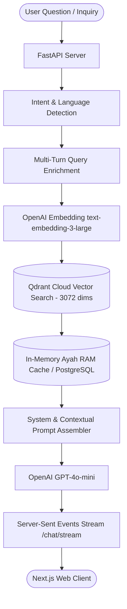

# ⚡ Quran Insights — FastAPI RAG Intelligence Backend

---

## 🌟 About Quran Insights

**Quran Insights** is an authentic, AI-powered conversational intelligence platform designed to bridge the timeless wisdom of the Holy Quran with modern seekers, students, and researchers worldwide. 

Unlike general-purpose conversational chatbots that might hallucinate or provide unverified advice, Quran Insights utilizes a strict **Retrieval-Augmented Generation (RAG)** pipeline. Every answer is deterministically grounded in semantic vector embeddings across all **6,236 verses**, accompanied by exact Surah citations, original Arabic text, authentic multi-language translations (English & Urdu), and Qari recitations.

🔗 **Live Web Application**: [https://quraninsights-ai.vercel.app](https://quraninsights-ai.vercel.app)  
🔗 **Production API Server**: [https://quran-insights-server.fastapicloud.dev](https://quran-insights-server.fastapicloud.dev)

---

## 🏛️ System Architecture

---

## ✨ Core Capabilities

- **🔍 Vector Semantic Search**: Hybrid cosine similarity matching against 6,236 Ayahs vectorized with OpenAI `text-embedding-3-large` (3,072 dimensions) indexed in Qdrant Cloud.
- **⚡ In-Memory High-Speed Cache**: Entire Quran dataset pre-loaded into RAM on startup (0.01ms lookup) with resilient PostgreSQL database fallback.
- **🌊 Real-Time SSE Streaming**: Full support for Server-Sent Events (`POST /chat/stream`) and JSON responses (`POST /chat`).
- **🧠 Multi-Turn Conversational Context**: Preserves past conversation turns and enriches follow-up queries for deeper understanding.
- **🌐 Multilingual Intelligence**: Tailored prompt generation for English, Urdu (اردو), and Arabic (العربية) with structured bullet points and highlighted key concepts.
- **🛡️ Strict Grounding & Verification**: Every response is verified against retrieved Quranic verses with explicit Surah and Ayah number citations.

---